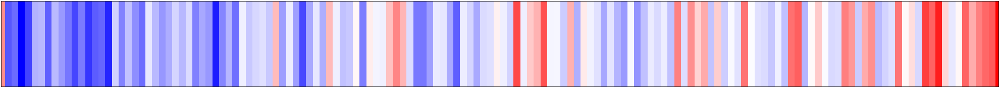

# Reproducible Temperature Visualisations with MATLAB

This repo contains some simple visualisations of surface temperature data with MATLAB for you to run.

The goal is to demonstrate a reasonably reproducible project with some interesting data.

The data source used is ["Compiled historical daily temperature and precipitation data for selected 210 U.S. cities"](https://kilthub.cmu.edu/articles/dataset/Compiled_daily_temperature_and_precipitation_data_for_the_U_S_cities/7890488) available on Carnegie Mellon University's data repository.

## Dependencies
This project requires:
+ MATLAB
+ [MATLAB Financial Toolbox](https://uk.mathworks.com/products/finance.html) (we use some handy date based analyses)

(Note: if you're using MATLAB online, you shouldn't have to think about dependencies.)

## How to use this repo
The repo consists of:

+ a livescript (`temperature_visualisation.mlx`) which shows how to use the code to obtain and visualise the data,
+ a MATLAB project file (`temperature_visualisations.prj`) used to set up the path before running,
+ a number of source code files located in the `src` directory.

### via MATLAB Online

MATLAB Online is a license-free way to run MATLAB projects like this one in the cloud.

[Open this project in MATLAB Online](https://matlab.mathworks.com/open/github/v1?repo=reproducibleMATLAB/temperature-visualisations&project=temperature_visualisations.prj&file=temperature_visualisations.mlx)

Once you're up and running, the livescript `temperature_visualisation.mlx` should open up (open it if not), you can then step through section by section. Have fun!

### On your local MATLAB installation

First, get the code with one of the following options:
+ **With git** (recommended): Clone this repository either from the command line (`git clone https://github.com/reproducibleMATLAB/temperature-visualisations.git`) or [using MATLAB's git integration](https://uk.mathworks.com/help/simulink/ug/clone-git-repository.html). Open the folder up in MATLAB.
+ **Without git**: From the [repository's GitHub page](https://github.com/reproducibleMATLAB/temperature-visualisations), under the green `Code` button, select `Download ZIP` to download a zip file of the code. Unzip it somewhere useful and open the folder up in MATLAB.

Run the project file `temperature_visualisation.prj` to ensure that all the source code is on the PATH and all the dependencies are installed.

Once you're up and running, open the livescript `temperature_visualisation.mlx`, you can then step through section by section. Have fun!

## Contributing
Contributions to the project are very welcome! They can take many forms:

+ [open an issue](https://github.com/reproducibleMATLAB/temperature-visualisations/issues/new) to point out an error or bug :bug: or to make (helpful) suggestions.
+ even better, contribute that code yourself by opening a pull request on GitHub!

Examples of possible contributions include:
+ correcting the source code to make better use of community standards,
+ adding tests,
+ adding new visualisations,
+ adding some analysis.

When making changes to the code, please take into account this advise:
+ please follow MATLAB style guidelines,
+ aim to make your code as reusable and modular as possible,
+ add any new files to the project file,
+ when editing binary files such as `mlx` files, be aware that git can't merge these very well, so keep changes small,
+ Be friendly in your pull requests!
